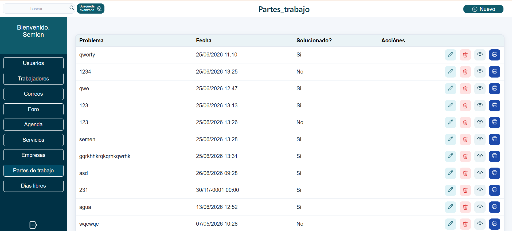
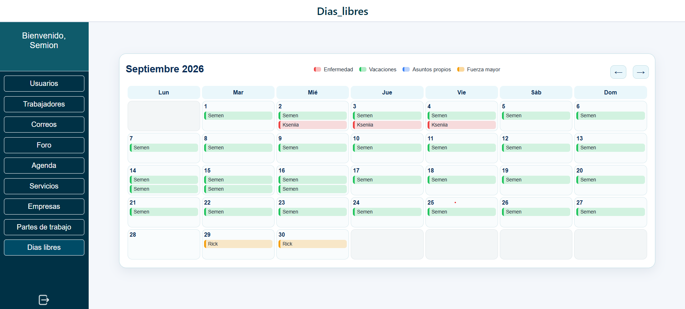
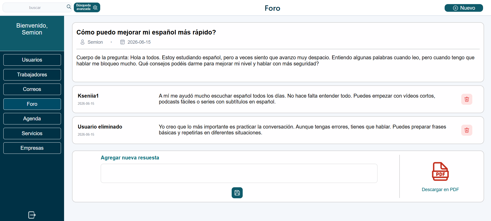

# PHP/MySQL Business Management Application

[English](#english) · [Español](#español)

## Screenshots / Capturas

### Work reports / Partes de trabajo


### Employee days off / Días libres de trabajadores


### Forum / Foro


### Login / Inicio de sesión


---

<a id="english"></a>
## English

### About the project

I developed this application during a one-month professional internship at Grupo Futuro in Spain in 2026.

My mentor gave me tasks one by one. I implemented each task independently, showed the result, and then continued with the next one.

The application was created for internal company use and was used by the company after my internship.

> This repository preserves the project in the state in which I completed it during the internship. The source code has not been retrospectively rewritten or modernized for portfolio purposes.

### What is inside

The project includes several sections:

- users
- employees
- companies
- company follow-ups
- mail records
- forum
- agenda
- services
- work reports
- employee days off
- employee documents

The application allows users to create, view, edit, search and delete different types of records.

Some sections also include document upload and download, PDF generation, advanced search and dynamic updates without reloading the whole page.

### Technologies

- PHP
- MySQL
- PDO
- SQL
- HTML
- CSS
- JavaScript
- Fetch API
- Async/Await
- FormData
- DOM
- Composer
- Dompdf

### Backend and database

The backend was written in plain PHP without a framework.

The application works with a MySQL database through PDO. The project contains `SELECT`, `INSERT`, `UPDATE` and `DELETE` queries, including prepared statements.

It also includes user login/logout, form processing, validation, file handling and PDF generation.

### JavaScript

JavaScript is used for interface logic and asynchronous requests.

In different parts of the project I used:

- `fetch()`
- `async / await`
- `FormData`
- DOM updates

This made it possible to send and receive data without reloading the whole page.

### Main folders

```text
agenda/
ajax/
correos/
dias_libres/
empresas/
foro/
partes_trabajo/
servicios/
trabajadores/
usuarios/
```

### Database

The project includes the MySQL database export used by the application.

The database contains the tables and test data needed for the main modules of the project.

### Author

Semen Shchouplov  
Full Stack Developer  
Spain · Open to relocation

---

<a id="español"></a>
## Español

### Sobre el proyecto

Desarrollé esta aplicación durante un mes de prácticas profesionales en Grupo Futuro, España, en 2026.

Mi tutor me daba las tareas una por una. Yo realizaba cada tarea de forma independiente, enseñaba el resultado y después continuaba con la siguiente.

La aplicación se creó para uso interno de la empresa y siguió utilizándose después de mis prácticas.

> Este repositorio conserva el proyecto en el estado en el que lo terminé durante las prácticas. El código fuente no ha sido reescrito ni modernizado posteriormente con fines de portfolio.

### Qué incluye

El proyecto tiene varias secciones:

- usuarios
- trabajadores
- empresas
- seguimientos de empresas
- correos
- foro
- agenda
- servicios
- partes de trabajo
- días libres de trabajadores
- documentos de trabajadores

La aplicación permite crear, consultar, editar, buscar y eliminar diferentes tipos de registros.

En algunas secciones también hay carga y descarga de documentos, generación de PDF, búsqueda avanzada y actualización dinámica de información sin recargar toda la página.

### Tecnologías

- PHP
- MySQL
- PDO
- SQL
- HTML
- CSS
- JavaScript
- Fetch API
- Async/Await
- FormData
- DOM
- Composer
- Dompdf

### Backend y base de datos

El backend está escrito en PHP puro, sin framework.

La aplicación trabaja con una base de datos MySQL mediante PDO. En el proyecto hay consultas `SELECT`, `INSERT`, `UPDATE` y `DELETE`, incluidas consultas preparadas.

También hay inicio y cierre de sesión, procesamiento y validación de formularios, gestión de archivos y generación de PDF.

### JavaScript

JavaScript se utiliza para la lógica de la interfaz y para peticiones asíncronas.

En diferentes partes del proyecto utilicé:

- `fetch()`
- `async / await`
- `FormData`
- actualización del DOM

Esto permite enviar y recibir información sin recargar completamente la página.

### Carpetas principales

```text
agenda/
ajax/
correos/
dias_libres/
empresas/
foro/
partes_trabajo/
servicios/
trabajadores/
usuarios/
```

### Base de datos

El proyecto incluye la exportación de la base de datos MySQL utilizada por la aplicación.

La base de datos contiene las tablas y los datos de prueba necesarios para los principales módulos del proyecto.

### Autor

Semen Shchouplov  
Full Stack Developer  
España · Disponible para reubicación
